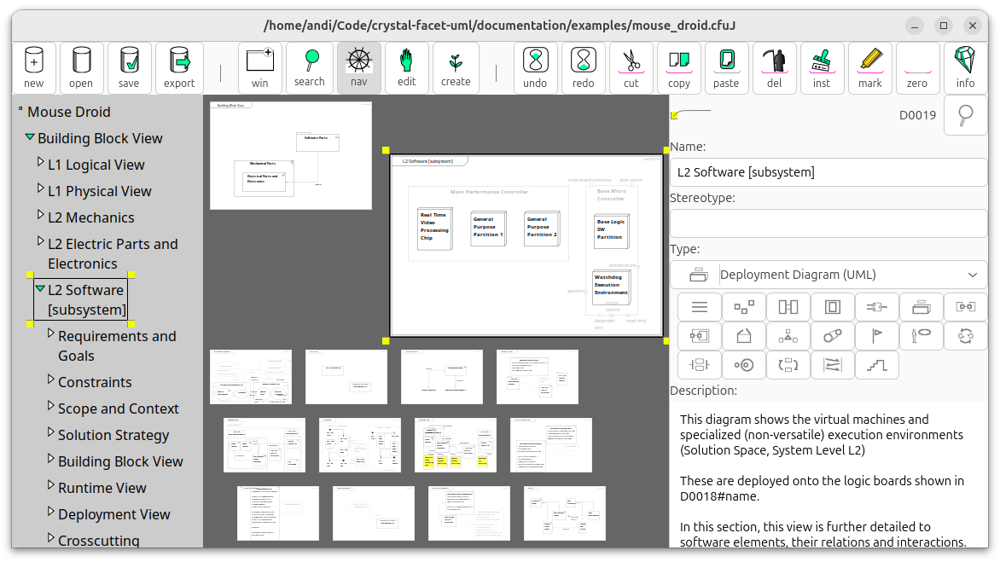

crystal-facet-uml
=============

<!-- What is it? -->
crystal-facet-uml creates sysml/uml diagrams to document system and software architecture.

Like a crystal shows different facets of the same thing, this application shows different views of the same system.

<!-- For Whom? What can one do with it? Why does it help? -->
As software architect, you create a set of diagrams describing
use-cases, requirements, structural views, behavioral and deployment views.

<!-- How does the tool solve the task? What is the data flow? Is it interoperable? input/output formats. required Environment? -->
crystal-facet-uml keeps element names and element hierarchies consistent.
It exports diagrams in svg, pdf, ps and png formats
to be used in text processing systems like docbook, html, latex.
crystal-facet-uml exports the model to json and xmi format; json can also be imported.
The json-based data file can be stored to git, branched and merged together with your source code.
This tool runs on your local linux PC and is based on glib, gdk, gtk, cairo, pango, sqlite.

How to use this program is described in the [User Manual](https://andreaswarnke.de/crystal-facet-uml/crystal-facet-uml_documentation.pdf) .

Install crystal-facet-uml
-----------

This section describes how to install a binary package.

Debian/Ubuntu/Raspbian:

>       sudo apt install crystal-facet-uml

or

>       sudo dpkg -i crystal-facet-uml_1.x.0-1_amd64.deb

openSuSE:

>       sudo zypper addrepo https://download.opensuse.org/repositories/devel:/tools/15.5 devel_tools_15.5
>       # or sudo zypper addrepo https://download.opensuse.org/repositories/devel:/tools/15.4 devel_tools_15.4
>       sudo zypper refresh
>       sudo zypper install crystal-facet-uml

or

>       sudo zypper install crystal-facet-uml-1.x.0-1.1.x86_64.rpm

Windows/wine:

Fetch a prebuild binary version from e.g. https://www.heise.de/download/product/crystal-facet-uml/
or https://sourceforge.net/projects/crystal-facet-uml/ and unpack it:

>       unzip crystal-facet-uml_1.x.0-1_win64.zip

How to build from source
-----------

Building from source is described in [./build](build) .

About
-----------

> Version: see META_VERSION_STR in [meta_version.inl](main/include/meta/meta_version.inl)
>
> Author+Copyright: 2016-2023 Andreas Warnke
>
> License: Apache 2.0 License
